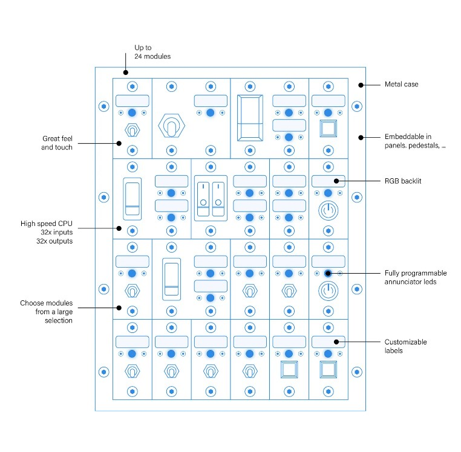

# Installation Instructions

How to install a MBx24

## Introduction

The Modules Bay  interfaces the real world with simulation software. It provides an easy way to collect data from the physical world that can be used by simulation software.
It is a peripheral which includes 32 input connectors for switches, buttons, etc., and 32 outputs for LEDs and low power digital devices. Also, it virtualizes more 32 inputs to allow simultaneous inverted actions of the physical ones. These are the VICe connectors.  
Features 24 bays for modules, own programmable high speed processing unit, a RGBW backlit and only one cable is used for connections.

## Installation
Installing a MBx24 is fairly simple using the following steps.
1. Make sure that the front panel power control switch is in the “Shutdown” position.
2. Choose an installation place at your discretion. It must be moisture and dust free.
3. Lay down the cable until it reaches your OBCS and connect the plug to any of the OBCS peripherals ports:
  * Match the white circle of the plug with the white circle of the OBCS connector (upwards)
  * With care, Insert the plug in that position
  * Screw the plug blue cap until it doesn’t rotate.
4. Adjust the standing foot and tilt:
* Releasing both side knobs lightly
* Adjust to the intended position
* Tight both knobs
 
## First power up
The MBx24 power is delivered by OBCS power unit. Turn the OBCS front panel power control switch to “Power ON”. The MBx24 self-test starts immediately and takes a few seconds. 
When the backlit turns on, the hardware is ready.
Write down the MBx24 serial number. It can be found on the identifying back plate. It will be needed for configurations and enumerations. 
Use the TOGA software to set up your MBx24. It is free and can be downloaded HERE. Also, you may download the SDK and create your own software.
