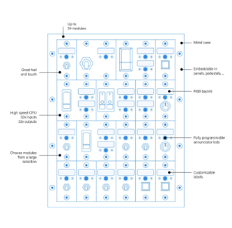

# Start Here

### Basis of a MBx24 & how it works

A Modules Bay is a peripheral that accommodates NorAirLabs modules. In the MBx24 case, up to 24 of
these modules. 

A module is a hardware part with input components, such as switches, and/or output components,
such as LEDs. There are various models and versions for many applications:

[Annunciators](https://norairlabs.com/product-category/module-bays/annunciators/) - Outputs (displays) the logic states of systems and/or parts, for example, turns ON when a failure occurs, a landing gear is extended or a truck engine overheated. It can also flash to call the user attention.

[Switches](https://norairlabs.com/product-category/module-bays/switches/) & [Push Buttons](https://norairlabs.com/product-category/module-bays/push-buttons/) - Activates features (turns ON or OFF) such as lights, handbreaks, train whistles, turning signals, etc.

The MBx24 features, beyond others, the flowing:
- 32 OUTPUTs to actuate LEDs and other low power devices
- 32 INPUTs to read logical states of switches, buttons, etc.
- 32 VIRTUAL INVERTED CONNECTOR Enhancement, or VICe connectors, to automatically inject
logical states to an INPUT without using hardware.

A VICe connector, as a virtual object, doesn’t exist physically. A VICe is nothing more than a
virtualized connector with an assigned joystick button number, created to mimic the inverted logic
state of a real input connector with the same connector number but with other joystick button
number. This is useful when a simulation software requires two joystick buttons to turn on and off
the same item: one to the ON logic state and another for the OFF logic state. The off logic state may
be created virtually as a VICe with an additional joystick button number, saving a physical
connector although occupying a joystick button number. This may not be an issue when there are
199 more available.

### Concepts

Every time 'ID' expression is used, it refers to ID attributed by enumeration. The MBx24 default ID is 50.

*Buttons* and *Connectors* are different things.

A 'Button' is a ***joystick button*** input and can be numbered from 1 to 200. This is a feature of
the OBCS hardware, not of the MBx24.

Each MBx24 has 64 'connectors': 32 input connectors and 32 output connectors.
A connector is a hardware part where a module plugs its wiring. It serves as a physical
interface between an input and/or output module and the MBx24 it self. Exception is
made to VICe connector because this are virtually created.

#### Input connectors

All input connectors are numbered from 1 to 32 and each one has a correspondence to a ***joystick
button number*** of the OBCS hardware. This way, when a *connector* is actuacted,
the correspondent *joystick button* responds to the simulation environment in the
same way. In a simple way, turn ON a connector and the simulation sees a joystick
button being pressed. One just have to define which joystick button number is this.

Assigned joystick buttons number defaults from button number 50 to 81.

The MBx24 suports configurations to these as push-buttons, toggle switches and both logicaly inverted.

#### Output connectors

Output connectors are used to connect low powered devices (LEDs, etc). In this are
included the [Annunciators](https://norairlabs.com/product-category/module-bays/annunciators/).
This connectors are numbered from 1 to 32. They can be configurated to normal use,
logicaly inverted or even flashing. The MBx24 output engine manages these individually,
even the flashing periods. This allows annunciators to flash independently.

#### VICe connectors

VICe, or Virtual Inverted Connector Enhancement, is a highly useful virtual tool provided
by your MBx24. It allows the association of two joystick buttons to the same connector:
one physical joystick button and an inverted one virtually created, or VICe.

This feature conserves physical connectors when simulation software requires a joystick
button to activate a feature and another to deactivate it. When the joystick button is
turned OFF, the associated joystick button to the VICe connector turns ON, and vice-versa.

A VICe connection is automatically created when it is associated with a joystick button and
it is destroyed if associated with the non-existent joystick button ***0***.

The joystick button and the VICe share the same input connector.

