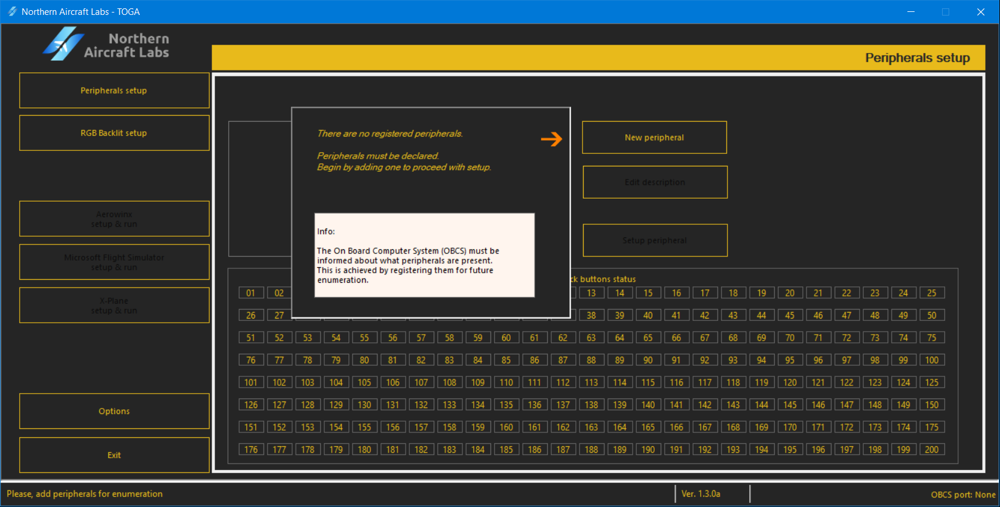
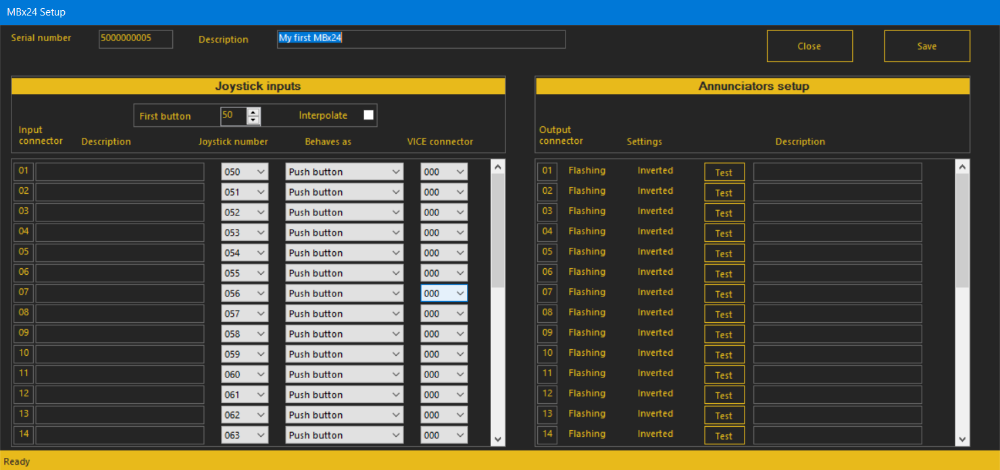

# Usage Instructions

How to use the MBx24 peripheral

## Before first run

The MBx24 peripheral has, as factory defaults, assigned OBCS joystick buttons
from 50 to 81. This can be changed by the TOGA software provided.

## Powering up

When the MBx24 is powered by the onboard computer system, it lights up all
annunciators for brief moments, allowing the user to check them. Then, these
are turned off and the backlit RGBW lights on with the default color. Your
MBx24 is ready.

## First run

Run the TOGA app.
If no peripheral is declared, you'll be asked to insert one to the peripherals list.

Press ***New peripheral***.

Insert the serial number written in the plate located in the back
of the peripheral. This is a 10 digit number which begins with 50.
Insert, also, a description of your choice to easily be recognized.
Use letters, numbers and spaces.

Confirm with ***Save***.

Your MBx24 is now declared and ready to be configured.

## Testing inputs of your MBx24

In the TOGA app, select the first tab at left ***Peripherals setup***.

At the bottom of this window, a joystick buttons matrix is displayed, named
***Joystick buttons status***.

Turn ON and OFF some push-buttons or switches and the matching joystick
button will light ON or OFF. If VICes are attributed to connectors, these
will light ON or OFF inversely to the correspondent joystick buttons.

## Configuring the MBx24

Run the TOGA app.

Select the first tab at left ***Peripherals setup***.

Select your MBx24 from the peripherals list.

Press ***Setup peripheral***

A new window appears to setup your peripheral.

This window is divided into two wings:
- the left one for joystick buttons setup
- the right one for annunciators setup

### Joystick buttons setup

Here you can set up your push-buttons and switches, making them correspond to joystick buttons.

This is factory defaulted to begin in the joystick button number 50 and end at 81.

> :bulb: ***Tip***
> 
> Select a different range for your joystick buttons number. Use the ***First button*** field to
> change it to whatever suits you better. You my try to select '1' and all the joystick buttons number
> range will automatically and imediatly change to 1 up to 31.

> :bulb: ***Tip***
> 
> Check the ***Interpolate*** tick box to have your joystick buttons numbers interpolated, i.e, set to only
> even or odd numbers. It is usefull if using VICes in sequence with joystick buttons numbers.

Turn ON one push-button or switch. This will light up its connector on the very left, under _Input connector_.

Insert a description that identifies it like 'Landing lights', 'Truck horn', etc.

If desired, change the matching joystick button you like. Consider writing down this
for future reference.

Next, you may change the behaviour of this connector. For example, if a push-button is
connected to this connector and you want it to behave as a toggle switch, select ***Toggle***.

If required, select a joystick button for its VICe connector. When the push-button, switch, etc.,
is not actuated, the joystick button attributed to this connector will turn ON. The same happens
in the reverse situation.

> :warning: ***Warning***
> 
>  _If a joystick button is attributed to two or more connectors, VICes included,
unexpected behaviour may accour!_

### Annunciators setup

Here your can set up annunciators.

Press ***Test*** on an output connector. A pop up message appears with ***Turning ON connector XX***,
where XX is the connector number.

If an annunciator lights ON, this means that this is its connector.
If not, try the next one until one lights up.

Close the pop up message.

Insert the text written in the annunciator window into the description.

> :bulb: ***Tip***
> 
> This description is used for its identification later, when creating profiles.

Select the behaviour of this annunciator by turning on or off the settings ***Flashing*** or ***Inverted***.

Proceed to the next annunciator and repeat these steps.

### Saving the setups

On the top-right side of the window, press ***Save*** to save the peripheral configuration.

Pressing ***Close*** will close this window.

> :exclamation: ***Important note***
> 
> _Pressing ***Close*** without saving will cancel the modifications made during this set up._

## Congratulations

Your MBx24 is now configured and ready!

