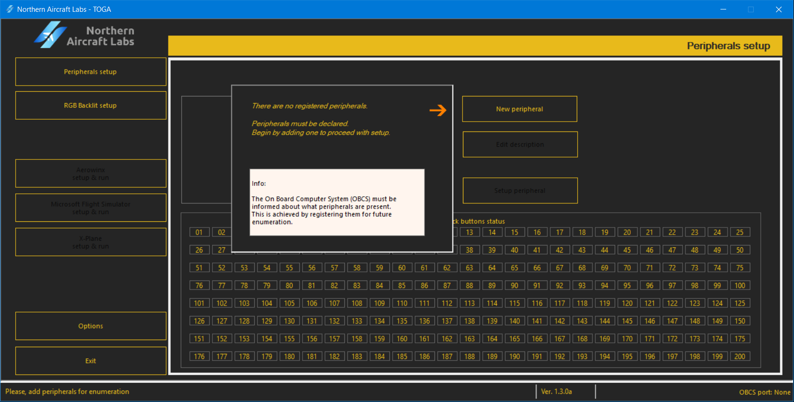
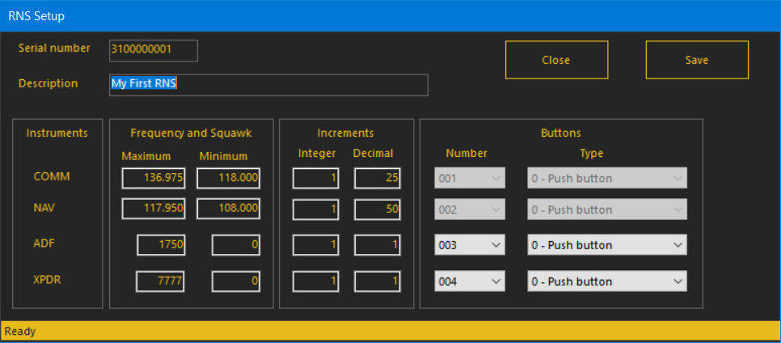

# Usage Instructions

How to use the RNS peripheral

## Default values

The RNS peripheral has, as factory defaults, assigned OBCS joystick buttons
from 1 to 4 to each knob:

|Push-button|Assigned joystick button|
|---|---|
|COMM knob push-button|
1
|
|NAV knob push-button|
2
|
|ADF knob push-button|
3
|
|XPDR knob push-button|
4
|

This can be changed by the TOGA software provided.

Each instrument in your RNS have factory default values.

These values can be changed with the TOGA software very easily.

> ❗ ***Note***
> 
> The RNS restore these values to factory default at power up, after every hard or soft resets.

| Instrument | Field | Default value|Integer increment|Decimal increment|
|---|---|---|---|---|
|COMM|
|    |Active/Standby maximum frequency|136.975|1|25|
|    |Active/Standby minimum frequency|118.000|1|25|
|NAV|
|    |Active/Standby maximum frequency|117.950|1|50|
|    |Active/Standby minimum frequency|108.000|1|50|
|ADF|
|   |Maximum frequency|9999|1|1|
|   |Minimum frequency|0000|1|1|
|XPDR|
|    |Maximum squawk code|7777|1|1|
|    |Minimum squawk code|0000|1|1|

## Powering up

When the RNS is powered by the onboard computer system, the displays start
counting from 0 to 9 as a test, allowing the user to check them. Then, these
are turned to ' - ' and the backlit RGBW lights on with the default color.

The default frequencies are displayed.

Your RNS is ready.

## First run

Run the TOGA app.
If no peripheral is declared, you'll be asked to insert one to the peripherals list.

Press ***New peripheral***.

Insert the serial number written in the plate located in the back
of the peripheral. This is a 10 digit number which begins with 31.
Insert, also, a description of your choice to easily be recognized.
Use letters, numbers and spaces.

Confirm with ***Save***.

Your RNS is now declared and ready to be configured.

## Testing Push-Buttons of your RNS

In the TOGA app, select the first tab at left ***Peripherals setup***.

At the bottom of this window, a joystick buttons matrix is displayed, named
***Joystick buttons status***.

Turn ON and OFF each push-button (push down the central knob rim) and the matching joystick
button will light ON or OFF.

## Configuring the RNS

Run the TOGA app.

Select the first tab at left ***Peripherals setup***.

Select your RNS from the peripherals list.

Press ***Setup peripheral***

A new window appears to setup your peripheral.

This window have panels to insert the desired values in each instrument:

* Insert a maximum value and a minimum value. This should be multiples of the increments inserted.
> The ADF and XPDR are composed by two pairs of digits. For example, a 0367 frequency in ADF is
> internaly seen as "03" and "67" as integer and decimal parts, respectively.

* Choose a joystick button number for each instrument push-button. Greyed inputs means no availability.

* Select the behaviour for each push-button. For example, if one push-button is set to ***Toggle*** it will behave as such.

> :warning: ***Warning***
> 
>  _If a joystick button is attributed to two or more inputs, MBx24 VICes included,
unexpected behaviour may accour!_

### Saving the setups

On the top-right side of the window, press ***Save*** to save the peripheral configuration.

Pressing ***Close*** will close this window.

> :exclamation: ***Important note***
> 
> _Pressing ***Close*** without saving will cancel the modifications made during this set up._

## Congratulations

Your RNS is now configured and ready!
