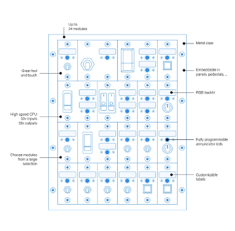

# Start Here

### Basis of a MBx24 & how it works

A Modules Bay is a peripheral that accommodates NorAirLabs modules. In the MBx24 case, up to 24 of
these modules. 

A module is a hardware part with input components, such as switches, and/or output components,
such as LEDs. There are various models and versions for many applications:

[Annunciators](https://norairlabs.com/product-category/module-bays/annunciators/) - Outputs (displays) the logic states of systems and/or parts, for example, turns ON when a failure occurs, a landing gear is extended or a truck engine overheated. It can also flash to call the user attention.

[Switches](https://norairlabs.com/product-category/module-bays/switches/) & [Push Buttons](https://norairlabs.com/product-category/module-bays/push-buttons/) - Activates features (turns ON or OFF) such as lights, handbreaks, train whistles, turning signals, etc.

The MBx24 features, beyond others, the flowing:
- 32 OUTPUTs to actuate LEDs and other low power devices
- 32 INPUTs to read logical states of switches, buttons, etc.
- 32 VIRTUAL INVERTED CONNECTOR Enhancement, or VICe connectors, to automatically inject
logical states to an INPUT without using hardware.

A VICe connector, as a virtual object, doesn’t exist physically. A VICe is nothing more than a
virtualized connector with an assigned joystick button number, created to mimic the inverted logic
state of a real input connector with the same connector number but with other joystick button
number. This is useful when a simulation software requires two joystick buttons to turn on and off
the same item: one to the ON logic state and another for the OFF logic state. The off logic state may
be created virtually as a VICe with an additional joystick button number, saving a physical
connector although occupying a joystick button number. This may not be an issue when there are
199 more available.

### Concepts

Every time 'ID' expression is used, it refers to ID attributed by enumeration. The MBx24 default ID is 50.

*Buttons* and *Connectors* are different things.

A 'Button' is a ***joystick button*** input and can be numbered from 1 to 200. This is a feature of
the OBCS hardware, not of the MBx24.

Each MBx24 has 32 'connectors', known as input connectors or even "In connectors".
These are numbered from 1 to 32 and each one has a correspondence to a ***joystick
button number*** of the OBCS hardware. This way, when a *connector* is actuacted,
the correspondent *joystick button* responds to the simulation environment in the
same way. In a simple way, turn ON a connector and the simulation sees a joystick
button being pressed. One just have to define which joystick button number is this.

Assigned joystick buttons number defaults to "ID value" until "ID + 31"
after enumeration.

For example, if ID is 50, joystick buttons number for this MBx24 will range from 50
to 81. This means that connector 1 is the joystick button number 50, connector 2 is the joystick
button number 51 and so on until connector 32 is the joystick button 81.

This is fully reversible to what range is needed by setting it with the *First button Number* 
instruction. For further details, see [Set First Button Number](./instruction-set/set-first-button-number.md)

### Responses and actions

The MBx24 gives a response to almost all instructions sent to it. This is an important feature
and should be used as part of procedures.

Normally, the response returns a header with the hardware address, or ID, followed by the
instruction requested and, when appropriate, the result of the execution. This last should
be read and interperted every time to correct actions if needed. All instructions that have
meaningful responses are documented here.

For smooth running, it is advisable to read the responses the hardware sends to check if
the requests was fulfilled.

*Responses* exist to assist development, debuging and running software.
