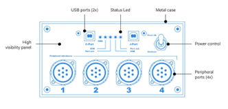

# Start Here

## Introduction

The On Board Computer System (OBCS) by NorAir Labs is an all-in-one hardware package
designed to provide seamless power, input, and output management without cable entanglement.

It is a two core computer that accommodates a 200 buttons joystick and a serial COM port.
This last allows users to talk to the OBCS, to the joystick and to the peripherals.

There are 4 peripheral ports to connect to peripherals, like NorAir Labs Radio & Navigation System or Modules Bays, as well as two USB connectors:

The J-PORT, the 200 buttons joystick device

The C-PORT, a serial port for communications.

## Installation

Choose a well-vented, free of moisture and dust place to install the OBCS unit.

Take care to keep out of reach of children as OBCS has moving parts (fans) and it connects to mains power.

OBCS cannot be enclosed with furniture. Keep the fan vent free and away from small objects as those can be aspirated by the cooling fans.

Make sure the main switch at the front panel power control switch is in the “Shutdown” position (refer to the enclosed picture)

Connect the peripherals to any available peripheral ports, in any order. Ports are numbered only as a visual aid.

Plug the power cord into the mains.

Insert both USB cables into the front panel connectors.

Connect both USB cables to your computer.

Turn the front panel power control switch to “Power ON”

Windows will now recognize and enumerate both devices. This may take some time.

To see these, go to Control Panel->Devices and Printers. There must appear two new devices as “Serial Port COMx:” and “Northern Aircraft Labs Joystick”.
When both devices are enumerated, a check mark should appear upon their icons. After this, the hardware is ready to be used.
To configure your peripherals, you may run the TOGA software. It is free and can be downloaded HERE. Also, you may download the SDK and create your own software.

## Operation

In the day-to-day use, the OBCS doesn’t need any special operations. Use the front panel switch to turn it ON or to Shutdown it. After shutting down, wait some seconds to turn it back ON, if needed.
