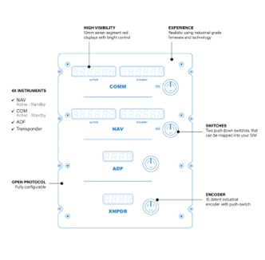

# Start Here

## Introduction

The Radio & Navigation System is composed of 4 instruments:

- The COMM radio, used for communications with other entities.
- The NAV radio, to tune frequencies of navigational aids.
- The ADF radio, to set frequencies of radio beacons for the Automatic Direction Finder.
- The Transponder, abbreviated to XPDR, for identification purposes.

The COMM and NAV are very similar and share common features :

- Two frequencies available.
- The Standby and the Active, each frequency supports up to 6 digits.
- 3 integers and 3 decimals.

The ADF is unique :

- Only one frequency and a 4-digit frequency
- 2 upper digits and 2 lower digits

The XPDR is similar to the ADF but manages an identification code, known as squawk code

The instruments data ( frequencies and squawk code ) is internally decomposed into parts for
management, as showed in table 2.

| Instrument | Frequency  | Integer Part | Decimal Part |
|------------|------------|--------------|--------------|
| NAV        | 108.100    | 108          | 100          |
| COMM       | 118.450    | 118          | 450          |
|  |  |       Upper 2 digits       |      Lower 2 digits        |
| ADF        | 0367       | 03           | 67           |
| XPDR       | 2306       | 23           | 06           |

**Table 2** - Decomposed instruments data

## Remarks

For a better understanding, the reason these instruments values are divided into integer and
decimal parts is because they reflect directly encoder movements. This gives freedom for users to
even change encoder attributes without knowing how the internal encoder drive engine works while
manipulating these and other values. Take note that all eight encoders present are completely

independent from each other’s and have their own individual processes, so there is total flexibility.
